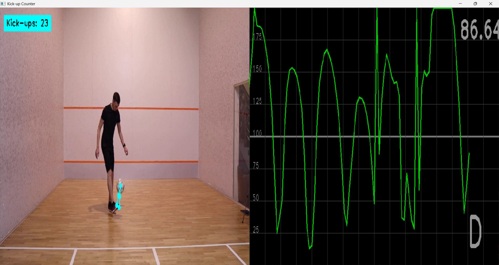

# Kick-up Counter with Real-time Ball Detection

A Python-based computer vision system that automatically counts football kick-ups by detecting ball-foot contact using pose estimation and object detection. The system provides real time visualization with distance tracking and kick counting.



## Overview

This project provides tools to:

1. **Real time Ball Detection**: Uses YOLOv11 to detect and track a sports ball in video
2. **Human Pose Estimation**: Detects body keypoints using cvzone's PoseDetector
3. **Contact Detection**: Calculates distance between ball and foot landmarks to detect kicks
4. **Automatic Counting**: Counts kick-ups with configurable contact threshold and cooldown
5. **Live Visualization**: Real time distance plotting and kick counter display
6. **Contact Feedback**: Visual indicators showing when ball-foot contact is detected

## Features

- **Automatic Kick Detection**: No manual counting required
- **Configurable Parameters**: Adjust contact threshold and cooldown timing
- **Real time Distance Tracking**: Live plot showing ball-to-foot distance
- **Visual Feedback**: Color-coded indicators for contact detection
- **Cooldown System**: Prevents double-counting rapid successive contacts
- **Resizable Display**: Adjustable window for different screen sizes

## 🗃️ Installation

```bash
git clone https://github.com/donsolo-khalifa/Kickups.git
cd Kickups
```

### Requirements

```bash
pip install -r requirements.txt
```

**Required packages:**
```
opencv-python
mediapipe
cvzone
ultralytics
numpy
```

## 📋 Usage

### Basic Usage

1. **Prepare your video**: Place your kick-up video file in the project directory
2. **Update video path**: Modify `VIDEO_PATH` in the script to point to your video
3. **Run the counter**:
   ```bash
   python main.py
   ```
4. **View results**: The system will display real time kick counting and distance tracking
5. **Exit**: Press 'q' to quit and see final count

### Configuration

#### Key Parameters

```python
# Contact Detection Parameters
CONTACT_THRESHOLD = 70      # Distance in pixels to trigger kick detection
COOLDOWN_FRAMES = 13        # Frames to wait before counting another kick

# Detection Landmarks
CONTACT_LANDMARKS = [31, 32]  # Foot keypoints (left, right)

# Video Settings
VIDEO_PATH = 'vidb.mp4'           # Path to your video file
YOLO_WEIGHTS = 'yolo11x.pt'       # YOLO model weights
```

#### Customization Options

- **Contact Threshold**: Adjust `CONTACT_THRESHOLD` for different ball sizes or detection sensitivity
- **Cooldown Period**: Modify `COOLDOWN_FRAMES` to prevent double counting
- **Contact Points**: Change `CONTACT_LANDMARKS` to use different body parts:
  - `[25, 26]` - Knees
  - `[27, 28]` - Ankles  
  - `[31, 32]` - Foot (default)
  - `[25, 26, 27, 28, 29, 30 31, 32]` - Knees, Ankles, Foot and Heels (unstable)
- **Video Source**: Use `cv2.VideoCapture(0)` for webcam input

## 🎮 Controls

- **'q'**: Quit the application
- **Window Resize**: Drag window corners to adjust size

## 🔧 How It Works

### Detection Pipeline

1. **Frame Processing**: Each video frame is processed for pose and object detection
2. **Ball Detection**: YOLOv11 identifies and tracks the sports ball (COCO class 32)
3. **Pose Estimation**: cvzone PoseDetector finds 33 body landmarks
4. **Distance Calculation**: Measures distance between ball center and specified body landmarks
5. **Contact Detection**: Triggers kick count when distance falls below threshold
6. **Cooldown Management**: Prevents immediate re counting using frame based cooldown

### Visual Elements

- **Green Circle**: Ball detection indicator
- **Yellow Lines**: Distance measurement lines between ball and contact points
- **Distance Plot**: Real time graph showing ball-to-foot distance
  - **Green**: During cooldown period (kick recently detected)
  - **Red**: Normal tracking mode
- **Kick Counter**: Large text display showing current count

## 📊 Output

The system provides:

- **Real time kick counting** displayed on screen
- **Distance visualization** with live plotting
- **Final count** printed to console when video ends
- **Visual feedback** for contact detection events

## ⚙️ Technical Details

### Performance Considerations

- **Model Size**: YOLOv11x provides high accuracy but slower processing. Use smaller variants (n, s, m, l) for better performance
- **Video Resolution**: Higher resolution videos provide better detection but slower processing
- **Contact Threshold**: Lower values increase sensitivity but may cause false positives

### Supported Formats

- **Video**: MP4, AVI, MOV, and other OpenCV-supported formats
- **Real time**: Webcam input (change `VIDEO_PATH` to `0` , `1` or the index of any external camera)

## 🎛️ Advanced Configuration

### Custom Contact Points

To detect kicks with different body parts:

```python
# For ankle detection
CONTACT_LANDMARKS = [27, 28]  # Left ankle, Right ankle

# For knee detection  
CONTACT_LANDMARKS = [25, 26]  # Left knee, Right knee

# For multiple points
CONTACT_LANDMARKS = [27, 28, 31, 32]  # Ankles and Foot
```

### Sensitivity Tuning

- **Increase Sensitivity**: Lower `CONTACT_THRESHOLD` value
- **Decrease False Positives**: Higher `CONTACT_THRESHOLD` value
- **Faster Counting**: Lower `COOLDOWN_FRAMES` value
- **Prevent Double Counting**: Higher `COOLDOWN_FRAMES` value

## 🚧 Troubleshooting

### Common Issues

**No ball detected:**
- Ensure ball is clearly visible in video
- Check lighting conditions
- Try adjusting video quality

**False kick counts:**
- Increase `CONTACT_THRESHOLD` value
- Increase `COOLDOWN_FRAMES` for longer pause between counts

**Missed kicks:**
- Decrease `CONTACT_THRESHOLD` value
- Ensure pose landmarks are properly detected
- Check if contact landmarks are appropriate for kicking style

**Performance issues:**
- Use smaller YOLO model (yolo11n.pt, yolo11s.pt)
- Reduce video resolution
- Process every nth frame only


## 📄 License

This project is licensed under the MIT License - see the [LICENSE](LICENSE.txt) file for details.
